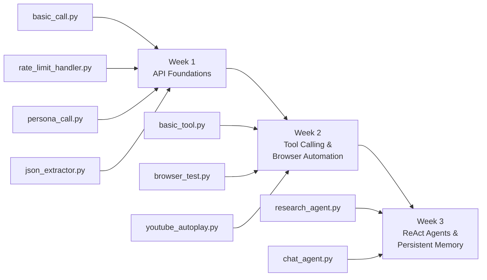
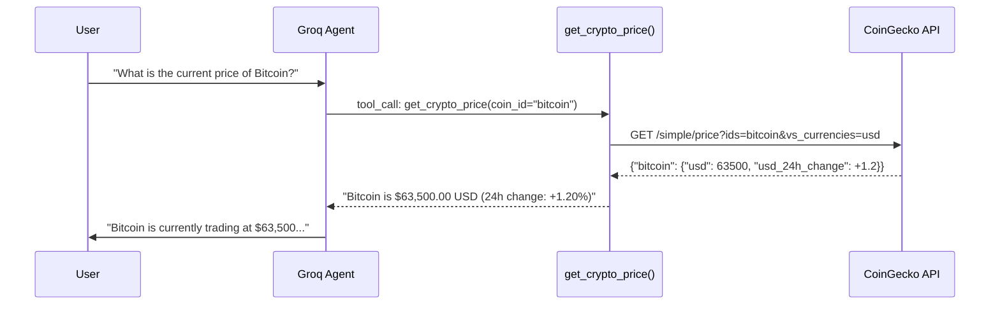
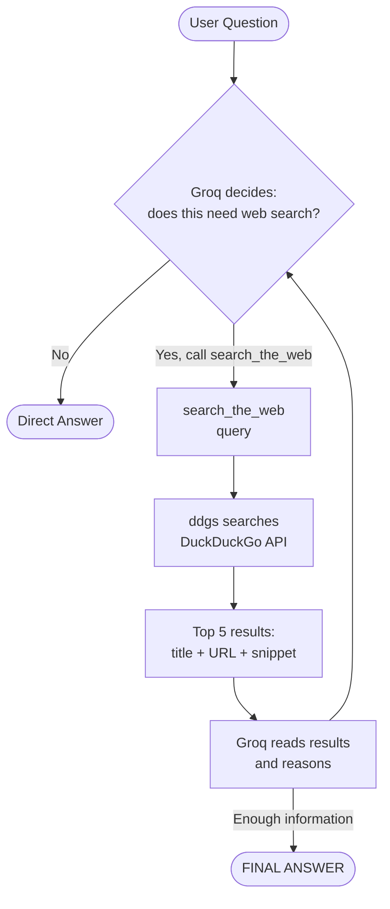
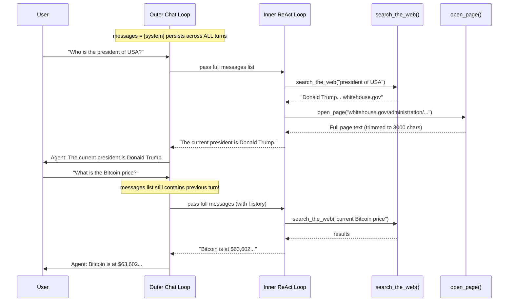

# Cognition Loop SOC 2026 — Submission

<div align="center">

**Building Autonomous AI Agents from the Ground Up**

| | |
|---|---|
| **Name** | Sugandh Kumar |
| **Roll Number** | 24B0357 |
| **Institute** | IIT Bombay |
| **Program** | Cognition Loop Summer of Code 2026 |
| **Repository** | [Sugandh-vI/COG_LOOP_24B0357_SOC](https://github.com/Sugandh-vI/COG_LOOP_24B0357_SOC) |

</div>

---

## Project Overview

This repository documents my three-week journey through the Cognition Loop Summer of Code (SOC) program, where I built a progressively more capable AI agent system from scratch.

The SOC is structured as a deliberate learning ladder. Each week adds a new layer of capability on top of what was built the week before — by the end, what started as a single API call has grown into a fully autonomous, memory-enabled research agent that can search the live web, chain multiple tools, and hold a coherent multi-turn conversation.

### The Progression



| Stage | Capability | Files |
|---|---|---|
| 1 | Direct LLM calls and API integration | `basic_call.py` |
| 2 | Rate limit handling and resilience | `rate_limit_handler.py` |
| 3 | System prompts and persona control | `persona_call.py` |
| 4 | Structured data extraction from text | `json_extractor.py` |
| 5 | AI agents with real tool use | `basic_tool.py` |
| 6 | Live web scraping with a browser | `browser_test.py` |
| 7 | Full browser automation | `youtube_autoplay.py` |
| 8 | Autonomous ReAct research agents | `research_agent.py` |
| 9 | Memory-enabled multi-turn agents | `chat_agent.py` |

---

## Tech Stack

| Technology | Version | Role in Project |
|---|---|---|
| **Python** | 3.11 | Core programming language |
| **Groq API** | `groq==1.4.0` | LLM inference backend — all AI calls |
| **llama-3.3-70b-versatile** | — | Primary language model |
| **llama-3.1-8b-instant** | — | Fallback model for tool-calling reliability |
| **Playwright** | `playwright==1.60.0` | Headless and headed browser automation |
| **ddgs** | `ddgs==9.14.4` | DuckDuckGo search API (no bot detection) |
| **requests** | `requests==2.34.2` | HTTP client for external APIs |
| **python-dotenv** | `python-dotenv==1.2.2` | Secure API key loading from `.env` |
| **uv** | latest | Fast Python package and environment manager |

**Why Groq?** Groq's inference hardware (LPUs) delivers significantly lower latency than GPU-based providers, which matters a lot in agentic loops where the model may be called 3–5 times per user query. Fast responses make the agent feel responsive rather than frozen.

**Why Playwright?** Real-world websites are JavaScript-heavy, dynamic, and full of consent dialogs and lazy-loaded content. Playwright controls a real Chromium browser, so it handles all of this correctly — unlike `requests` + regex which breaks the moment a site renders anything client-side.

**Why `ddgs`?** DuckDuckGo's HTML search endpoint blocks headless Playwright with a CAPTCHA challenge (I discovered this during Week 3). The `ddgs` library calls DuckDuckGo's official API through a proper client, bypassing bot detection entirely.

---

## Repository Structure

```
cognition_loop_SOC/
│
├── .env                    # API keys (gitignored — never committed)
├── .gitignore              # Excludes .env, .venv, __pycache__, task files
├── .python-version         # Pins Python 3.11 for uv
├── pyproject.toml          # Project metadata and dependencies
├── uv.lock                 # Locked dependency versions
│
├── basic_call.py           # Week 1 – Simple Groq API call
├── rate_limit_handler.py   # Week 1 – 15-call loop with exponential backoff
├── persona_call.py         # Week 1 – Victorian butler via system prompt
├── json_extractor.py       # Week 1 – Structured JSON from unstructured text
│
├── basic_tool.py           # Week 2 – Groq tool-calling agent (CoinGecko)
├── browser_test.py         # Week 2 – Playwright Hacker News scraper
├── youtube_autoplay.py     # Week 2 – YouTube search and autoplay
│
├── research_agent.py       # Week 3 – ReAct loop with live web search
└── chat_agent.py           # Week 3 – Persistent memory + tool chaining
```

---

## Week 1 — Foundations of LLM Applications

The goal of Week 1 was to get comfortable with the fundamental building blocks: API calls, prompt design, error handling, and data extraction. These might seem like simple exercises, but every complex AI agent is built from exactly these primitives.

### `basic_call.py` — First Contact with an LLM API

**Objective:** Make a minimal, working call to the Groq API and print the response.

**Approach:**
- Load `GROQ_API_KEY` from `.env` using `python-dotenv` (never hardcode secrets)
- Initialise the `Groq` client
- Call `client.chat.completions.create()` with a single user message
- Print the raw text response

**Prompt used:** *"Explain Newton's Second Law in one sentence."*

**What this teaches:** The anatomy of an LLM API call — model selection, message formatting (role/content pairs), and response parsing. This pattern repeats in every single script that follows.

---

### `rate_limit_handler.py` — Writing Resilient Code

**Objective:** Simulate 15 rapid API calls and handle rate limit errors gracefully using exponential backoff — never crashing.

**Approach:**
- A `for` loop attempts 15 calls in quick succession
- A `try/except` block catches `groq.RateLimitError`
- On each caught exception, `time.sleep(backoff)` pauses execution
- Backoff doubles on each retry (5s → 10s → 20s...) capped at 60s
- On success, the loop moves to the next request

**Sample output:**
```
Request 1 successful: OK
Request 2 successful: OK
...
Rate limit hit on request 11, retrying in 5s...
Request 11 successful: OK
...
```

**What this teaches:** Production AI code must handle failures as a first-class concern. An agent that crashes on a rate limit is useless in a loop that may run hundreds of iterations overnight.

---

### `persona_call.py` — System Prompts and Persona Control

**Objective:** Use the `system` role to completely change the model's personality and writing style.

**Approach:**
- A detailed `system_instruction` is passed as the first message with `"role": "system"`
- The user message is a casual question: *"How is the weather today?"*
- The model's response must stay entirely within the persona

**Persona used:** Reginald, a formal Victorian-era butler who uses elaborate vocabulary and never uses modern slang.

**Sample output:**
> *"Milord, I am delighted to report that the meteorological conditions prevailing at present are quite favourable, with a gentle warmth and abundant sunshine illuminating the estate..."*

**What this teaches:** The system prompt is the most powerful lever you have over an LLM's behaviour. It establishes ground rules that override the model's defaults. This is the exact mechanism used in Week 3 to tell the agent when to search vs. when to answer directly.

---

### `json_extractor.py` — Making LLMs Output Machine-Readable Data

**Objective:** Extract structured data from a blob of unstructured text and parse it with Python's `json.loads()`.

**Input text:**
> *"We interviewed Alex Mercer today. He is 24 years old and works as a Junior Data Analyst. His technical toolkit consists of Python, SQL, and Tableau."*

**Approach:**
- System prompt strictly instructs the model to output **only** raw JSON — no markdown fences, no preamble
- Target schema: `{"name": "", "age": 0, "role": "", "skills": []}`
- Model response is passed directly to `json.loads()`
- The `skills` list is extracted and printed

**Expected output:**
```python
['Python', 'SQL', 'Tableau']
```

**What this teaches:** Getting reliable structured output from an LLM requires a very precise system prompt. This is the foundation of every agent that needs to make decisions based on LLM output — the output must be parseable, not conversational.

---

### What I Learned in Week 1

Week 1 taught me that LLM APIs are not magic black boxes — they are deterministic HTTP services that respond to carefully crafted inputs. The key insights were:

- **Role-based messaging:** The `system`, `user`, and `assistant` roles are not cosmetic — they fundamentally change how the model processes a request. The `system` prompt acts like a persistent instruction layer that frames everything the model does.

- **Prompt precision matters enormously:** The difference between getting `['Python', 'SQL', 'Tableau']` and getting `Sure! Here is the JSON: \`\`\`json...` is entirely in how precisely you word the system instruction. I had to iterate on the `json_extractor.py` system prompt multiple times before the model stopped adding markdown wrappers.

- **Error handling is not optional:** An agent that crashes is worse than no agent at all. The exponential backoff pattern in `rate_limit_handler.py` is one I now apply by default in every network-calling code.

- **Keys in `.env`, never in code:** `python-dotenv` makes this frictionless, and `.gitignore` ensures the key never leaves my machine.

---

## Week 2 — Tool Calling and Browser Automation

Week 2 introduced two entirely new paradigms: giving the model the ability to *act* on the world (via tools), and automating a real browser to interact with websites.

### `basic_tool.py` — The Agent's First Hands

**Objective:** Build a proper Groq tool-calling agent that fetches live cryptocurrency prices from CoinGecko and explains the result in natural language.

**Architecture:**



**Implementation details:**
1. Define the tool as a JSON schema (name, description, parameters) in `TOOLS`
2. Pass `tools=TOOLS, tool_choice="auto"` to `client.chat.completions.create()`
3. If the response contains `tool_calls`, execute the named Python function
4. Append a `{"role": "tool", "tool_call_id": ..., "content": result}` message
5. Call the API again — the model now has the tool result and generates a final answer

**What this teaches:** Tool calling is the bridge between language and action. The model decides *when* a tool is needed, and *what arguments to pass* — the developer only has to write the tool itself.

---

### `browser_test.py` — Scraping the Live Web

**Objective:** Use Playwright to open Hacker News, extract the current top 20 headlines with their URLs, and print a numbered list. Optionally open a chosen link in the user's browser.

**Approach:**
- Launch Chromium headlessly with `sync_playwright()`
- Navigate to `https://news.ycombinator.com`
- Locate story rows with `tr.athing` and extract `.titleline > a` for title and href
- Print the numbered list to stdout
- Prompt the user for an optional link to open

**Sample output:**
```
1. I Stored a Website in a Favicon
   https://www.timwehrle.de/blog/i-stored-a-website-in-a-favicon/

2. Data Compression Explained (2012)
   https://mattmahoney.net/dc/dce.html
...
```

**Challenges:** Playwright selectors are tightly coupled to a site's DOM structure. Hacker News is relatively stable, but I still had to inspect the page source to find the correct selector chain. I also learned to handle `PlaywrightTimeoutError` gracefully for rows that fail to render.

---

### `youtube_autoplay.py` — Automating a Real Browser

**Objective:** Take a user query, open YouTube in a visible Chromium browser, search for it, click the first video result, and let it play.

**Implementation details:**
- Launches `headless=False` so the user can watch the automation in real-time
- Spoofs a realistic User-Agent to reduce bot-detection friction
- Calls `page.wait_for_load_state("domcontentloaded")` before querying the DOM
- Handles cookie/consent popups silently with `dismiss_consent_popup()`
- Attempts to skip pre-roll ads with `.ytp-skip-ad-button`

**The selector debugging story:** My first version used `input#search` — it worked in a 2023 browser session but YouTube's DOM had changed. Running a live DOM audit revealed:
```python
'input#search':            count=0   # Dead selector — no longer in YouTube's DOM
'input[name="search_query"]': count=1   # Correct current selector
```
This was a direct lesson in why selector maintenance matters in browser automation.

---

### What I Learned in Week 2

Week 2 cracked open two completely different mental models:

**On tool calling:** The model is not "calling a function" in the traditional sense — it is generating a structured JSON object that *describes* a function call, and *my code* runs the actual function. This distinction matters. The model's intelligence is in deciding *what* to call and *with what arguments*; the developer's job is to write the functions and handle the plumbing.

**On browser automation:** Real websites are adversarial environments for scrapers. I ran into:
- **Dynamic DOM:** Selectors that worked in static HTML analysis failed on the live page because YouTube renders elements client-side
- **Consent pop-ups:** Had to implement silent dismissal that does nothing if the dialog isn't present
- **Race conditions:** `page.wait_for_selector()` is essential — timing assumptions based on `time.sleep()` are fragile
- **Bot detection:** DuckDuckGo's HTML endpoint, which I thought was "simple HTML", turned out to block headless Playwright with a JavaScript challenge. This sent me on a debugging journey that ultimately led me to the `ddgs` library.

The gap between "code that works in a demo" and "code that works reliably on a live website" is large, and Week 2 made that gap viscerally clear.

---

## Week 3 — Building Autonomous Agents

Week 3 is where everything came together. The individual pieces — API calls, tool schemas, browser control — were wired into a genuine autonomous agent loop.

### `research_agent.py` — The ReAct Loop

**Objective:** Build a single-turn agent that decides when to search the web, executes the search with Playwright, and synthesises a final answer from the results.

**Architecture — The ReAct (Reason + Act) Pattern:**



**Key implementation decisions:**

1. **Tool schema as intent declaration:** The JSON schema tells Groq *what* the tool does and *what arguments it needs*. Groq uses this to decide when to call it — not every question triggers a search.

2. **Clean message serialisation:** A subtle bug I encountered: appending the raw Groq SDK response object (`msg`) directly to `messages` caused HTTP 400 errors on subsequent calls. The Pydantic model contained extra internal fields (`annotations`, `executed_tools`, `reasoning`) that Groq rejected when sent back. The fix was to convert to a minimal dict:
   ```python
   messages.append({
       "role": "assistant",
       "content": msg.content or "",
       "tool_calls": [{"id": tc.id, "type": "function",
                       "function": {"name": tc.function.name,
                                    "arguments": tc.function.arguments}}
                      for tc in msg.tool_calls],
   })
   ```

3. **Fallback model:** `llama-3.3-70b-versatile` occasionally generates malformed tool-call XML (`<function=name{...}>` instead of proper JSON), causing Groq to return HTTP 400. The `groq_chat_with_tools()` helper catches this specific error and transparently retries with `llama-3.1-8b-instant`.

**Sample output:**
```
User Question: What are the latest developments in agentic AI in 2026?

[Warning] llama-3.3-70b-versatile tool_use_failed, retrying with llama-3.1-8b-instant...
[Note] Using fallback model llama-3.1-8b-instant

TOOL CALL: search_the_web(query='latest agentic AI developments 2026')

TOOL RESULT:
Title: The State Of Agentic AI In 2026: Companies Are Chasing...
URL: https://www.forrester.com/blogs/...

FINAL ANSWER:
The latest developments in agentic AI in 2026 include...
```

---

### `chat_agent.py` — Memory and Tool Chaining

**Objective:** Extend the research agent into a persistent multi-turn conversation with two tools (`search_the_web` + `open_page`) and a memory that survives across turns.

**Architecture:**



**The memory mechanism is one list:**
```python
# This single list is the entire agent's memory.
# It persists outside both the chat loop and the ReAct loop.
messages = [{"role": "system", "content": SYSTEM}]

while True:                          # chat loop — one iteration per user turn
    user_input = input("You: ")
    messages.append({"role": "user", "content": user_input})

    while True:                      # ReAct loop — runs until no more tool calls
        response = groq_chat_with_tools(messages, TOOLS)
        # ... handle tool calls, append results to messages ...
        if not msg.tool_calls:
            messages.append({"role": "assistant", "content": msg.content})
            break
```

**Why resetting `messages` inside the chat loop breaks memory:** Every time you reset the list, the model loses all context of previous turns. The next question is answered as if the conversation never happened. Keeping `messages` outside both loops is the entire implementation of "memory."

**Tool chaining in action:** When asked about the president, the agent spontaneously decided to:
1. Call `search_the_web("president of USA 2024")` → got a Wikipedia snippet and a whitehouse.gov URL
2. Call `open_page("https://www.whitehouse.gov/administration/donald-j-trump/")` → got full page text
3. Synthesise a confident answer from the direct source

This multi-step reasoning happened automatically — I only wrote the tools and let the model decide how to use them.

---

## Challenges Faced

### Challenge 1: Groq HTTP 400 — `tool_use_failed`

**Symptom:** Any question that triggered a tool call resulted in:
```
Error code: 400 - {'code': 'tool_use_failed',
'failed_generation': '<function=search_the_web{"query": "..."}</function>'}
```

**Diagnosis:** This was actually two separate bugs:

1. The `messages.append(msg)` call was appending a Pydantic SDK object containing internal Groq fields. When sent back in the next request, the API rejected them.

2. `llama-3.3-70b-versatile` was generating malformed tool call syntax on certain queries — the model output XML-style tags instead of proper JSON tool_calls, and Groq's own parser rejected it before our code even ran.

**Fix:**
- Serialise assistant messages to clean minimal dicts (only `role`, `content`, `tool_calls`)
- Implement `groq_chat_with_tools()` which detects `tool_use_failed` and retries with `llama-3.1-8b-instant`

**Lesson:** When an AI system behaves unexpectedly, the bug can be in your code, in the SDK, *or in the model itself*. I had to prove which layer was responsible by stripping the problem down to a minimal reproduction before implementing the fix.

---

### Challenge 2: DuckDuckGo Bot Detection

**Symptom:** `search_the_web()` returned "No results found" even for obvious queries.

**Diagnosis:** Navigating to `https://html.duckduckgo.com/html/` in headless Playwright returned a 202 response with a CAPTCHA challenge form:
```html
<div class="anomaly-modal__title">Unfortunately, bots use DuckDuckGo too.</div>
```
Direct `requests.POST` also triggered the same challenge. Multiple public SearXNG instances were either rate-limiting or running behind certificate errors.

**Fix:** Switched to the `ddgs` Python package (`pip install ddgs`), which interfaces with DuckDuckGo's official API through a proper HTTP/2 client (`primp`) — no browser fingerprinting, no CAPTCHA.

**Lesson:** "Simple HTML endpoint" is not the same as "bot-friendly." Public search engines have strong incentives to block automated access. Finding a library that handles the API correctly is often better than fighting the anti-bot layer.

---

### Challenge 3: YouTube Selector Failure

**Symptom:** `youtube_autoplay.py` printed `"Error: Could not find the YouTube search box."` immediately.

**Diagnosis:** A direct DOM audit:
```python
'input#search':              count=0   # Expected selector — not in DOM
'input[name="search_query"]': count=1  # Actual selector
```

**Fix:** One-line selector change from `'input#search'` to `'input[name="search_query"]'`, plus adding `page.wait_for_load_state("domcontentloaded")` before the selector query.

**Lesson:** Selectors decay. A selector that worked when you last ran the script may fail weeks later when the site updates its frontend. DOM inspection against the live page is the only reliable debugging method.

---

## Key Learnings from the Entire SOC

This section is meant to be honest about what this project actually taught me, not just a list of bullet points.

**LLM applications are non-deterministic software.** Writing `requests.get()` gives you a predictable response from a deterministic server. Writing `client.chat.completions.create()` gives you a probabilistic response from a model that might refuse your format, generate malformed JSON, or choose not to call a tool it should have called. Building systems on top of LLMs means building systems that are *robust to unpredictable outputs*, not systems that assume perfect outputs.

**Tools transform models from oracles into agents.** A model without tools can only reflect on its training data. The moment you give it a `search_the_web` tool, it can answer questions about events that happened this morning. This is not a small upgrade — it's a fundamental shift in what the system can do. The interesting engineering challenge is defining tools clearly enough that the model calls them correctly.

**Browser automation is unexpectedly hard to get right.** Before this project, I thought Playwright was "just a tool that clicks things." After three weeks of fighting CAPTCHA systems, dead selectors, and race conditions, I understand it as a complex discipline. Real-world websites are not designed to be automated — they're designed to serve human users with unpredictable behaviour, and getting a headless browser to navigate them reliably requires careful handling of timing, state, and dynamic rendering.

**Memory in agents is architecture, not magic.** Persistent memory in `chat_agent.py` is implemented with a single Python list that is never reset. There is no database, no vector store, no special algorithm — just a list that grows as the conversation progresses. Understanding this makes the concept of "agent memory" much less mysterious, and also makes it clear why it hits limits: eventually the list gets too long for the model's context window.

**Debugging AI systems requires a different mindset.** When a normal function fails, you can step through it line by line until the logic breaks. When an AI agent fails, the problem might be in your code, in the library, in the model's output, or in the external service the model is trying to call. I learned to narrow down the layer first — reproduce with a minimal case, print every intermediate value, and never assume the model did what you asked it to do.

---

## How to Run

### Prerequisites

- Python 3.11+
- `uv` package manager ([install guide](https://docs.astral.sh/uv/))
- A Groq API key ([get one free at console.groq.com](https://console.groq.com))

### Setup

```bash
# 1. Clone the repository
git clone https://github.com/Sugandh-vI/COG_LOOP_24B0357_SOC.git
cd COG_LOOP_24B0357_SOC

# 2. Install all dependencies (uv reads pyproject.toml)
uv sync

# 3. Install Playwright's Chromium browser
uv run playwright install chromium
```

### Environment Variables

Create a `.env` file in the project root:

```bash
# .env
GROQ_API_KEY=your_groq_api_key_here
```

> ⚠️ `.env` is listed in `.gitignore` and is never committed. Keep your key private.

### Running Each Script

**Week 1:**
```bash
uv run python basic_call.py           # Simple LLM call
uv run python rate_limit_handler.py   # 15-call retry loop
uv run python persona_call.py         # Victorian butler persona
uv run python json_extractor.py       # Prints: ['Python', 'SQL', 'Tableau']
```

**Week 2:**
```bash
uv run python basic_tool.py           # Live crypto price via CoinGecko + Groq
uv run python browser_test.py         # Scrapes Hacker News headlines
uv run python youtube_autoplay.py     # Prompts for query, opens YouTube (headless=False)
```

**Week 3:**
```bash
uv run python research_agent.py       # One-shot research with live web search
uv run python chat_agent.py           # Interactive chat (type 'quit' to exit)
```

---

## Future Improvements

The current implementation is a complete working system, but there are several directions I'd like to explore:

| Idea | Description |
|---|---|
| **Vector memory** | Store past conversations in a vector database (e.g., ChromaDB) so the agent can recall relevant information from much older turns without filling the context window |
| **Multi-agent systems** | Separate the "researcher" and "synthesiser" roles into distinct agents that communicate through a shared message queue |
| **RAG pipelines** | Add a Retrieval-Augmented Generation layer so the agent can be pre-loaded with a private knowledge base (docs, PDFs) before a conversation starts |
| **Structured tool outputs** | Use JSON schemas for tool return values, not just plain strings, so the model can reason more precisely about what a tool returned |
| **Long-term memory** | Implement a memory summarisation loop — when the conversation history grows beyond N tokens, compress older turns into a summary and replace them |
| **Autonomous workflows** | Extend `chat_agent.py` into a goal-directed system that keeps acting until a user-defined success condition is met, without waiting for human input between steps |
| **Better error telemetry** | Log every tool call, its arguments, its result, and the model's reasoning into a structured trace file — invaluable for debugging agent failures |

---

## Acknowledgements

I want to thank the **Cognition Loop SOC mentors and organizers** for designing a curriculum that is genuinely well-thought-out. The week-by-week progression — starting with a single API call and building toward an autonomous agent — is exactly the right way to teach this material. Each week's tasks are small enough to be completable but large enough to expose real concepts.

The debugging challenges I hit during Week 3 (the Groq serialisation bug, the DuckDuckGo bot detection, the YouTube selector failure) were frustrating in the moment but turned out to be the most valuable learning experiences of the project. Fighting through a real bug teaches you more about a system than any tutorial can.

This project was completed as part of the **Cognition Loop Summer of Code 2026** program at IIT Bombay.

---

<div align="center">

*Built with curiosity, debugged with patience.*

**Sugandh Kumar · 24B0357 · IIT Bombay**

</div>
